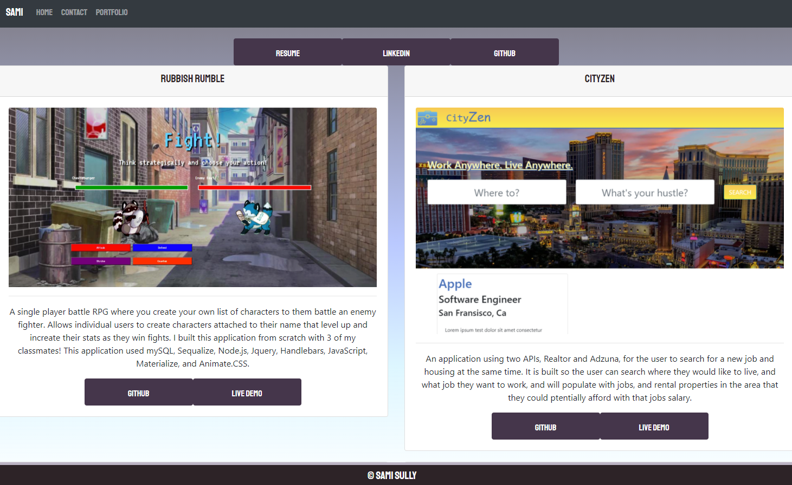

# Budget Tracker

[Live DEMO](https://lit-journey-98203.herokuapp.com/portfolio/)

## Description

My personal portfolio displaying general contact info and some examples of my work.

## Table Of Contents

- [Installation](#Installation)
- [Contributers](#Contributors)
- [Tests](#Tests)
- [License](#License)
- [Questions](#Questions)

## Installation

You can install directly through github, then run npm install.

## Contributors

Sami Sully and Georgia Tech Bootcamp Students and Staff for teaching me to write this!

(https://www.github.com/SamiSully)

HTML, CSS, BOOTSTRAP, JAVASCRIPT, NODE.JS, JQUERY, EXPRESS, & REACT.

## License

MIT License

(https://choosealicense.com/licenses/mit/)

Copyright © Sami Sully 2020

## Questions

If you have any questions, you can reach out to me directly at samilsully@gmail.com

https://getbootstrap.com/

Google Fonts
